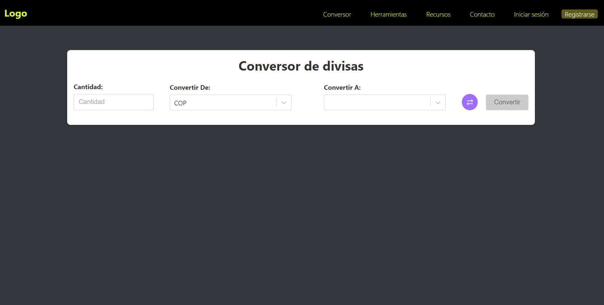
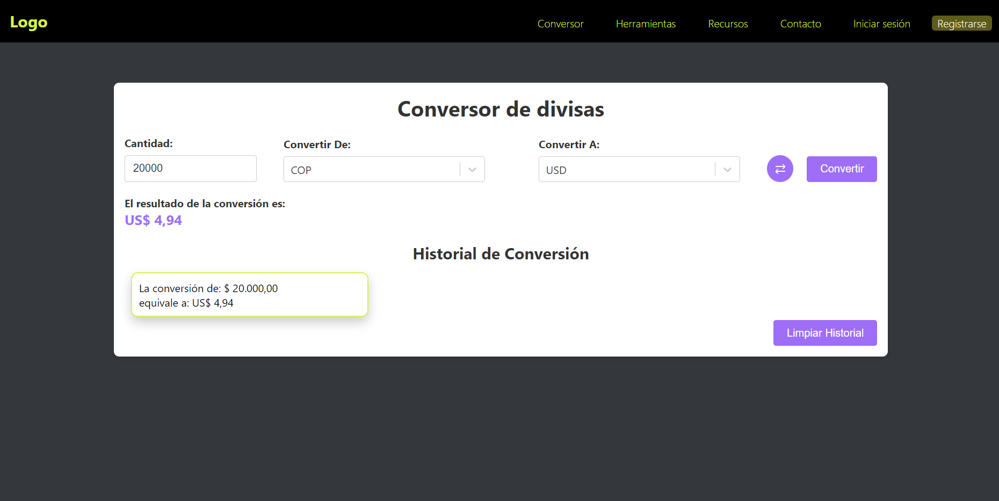
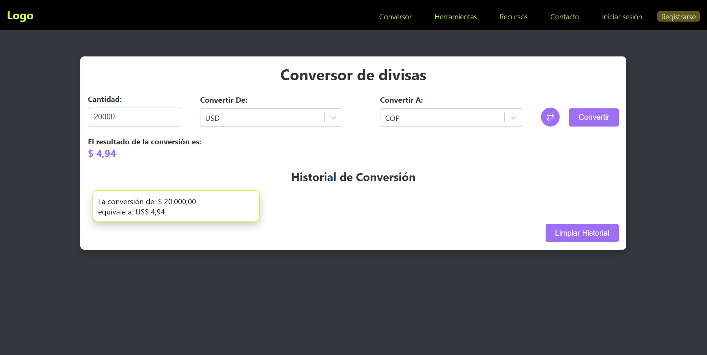
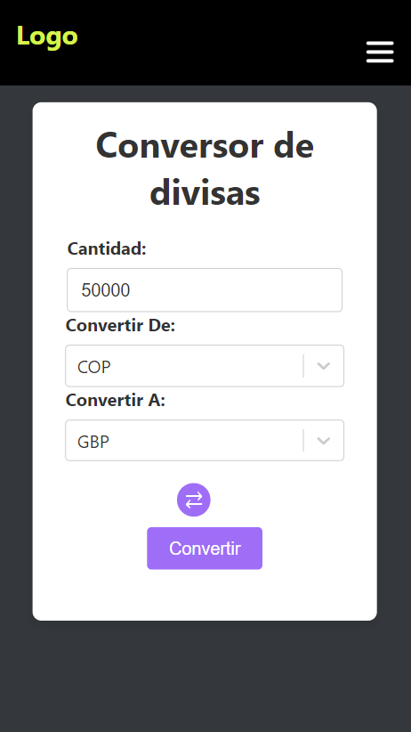
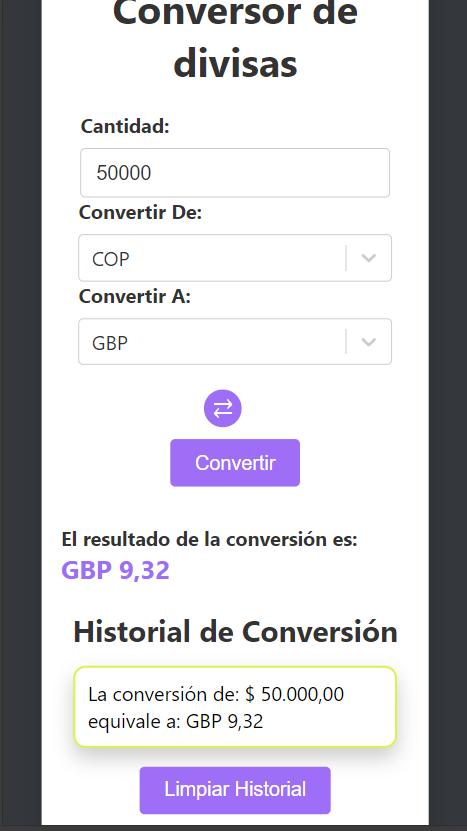
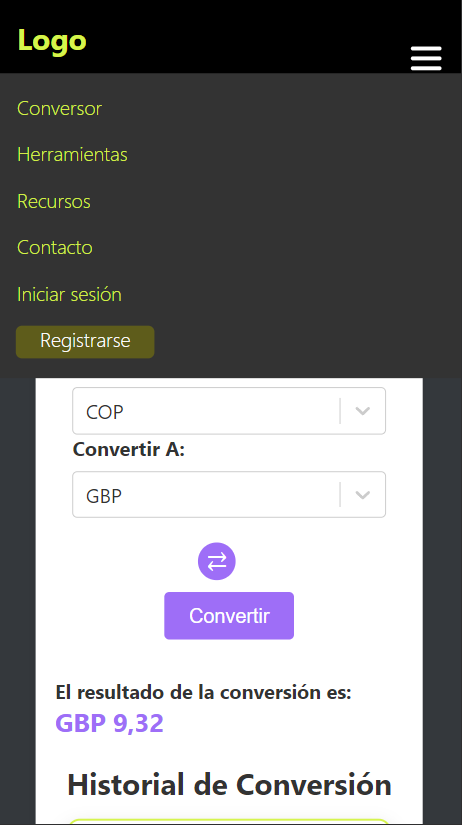

# Currency Converter

## Description

Currency Converter is a web application that allows users to convert amounts between different currencies using live exchange rates. The application provides a user-friendly interface where users can input the amount to be converted, select base and target currencies, and view the conversion result. It also maintains a history of conversions and provides an option to clear the history.

## Features

- Convert between different currencies with real-time exchange rates.
- Maintain a history of conversions.
- Swap base and target currencies with a single click.
- Responsive design with a visually appealing interface.

## Installation

To get started with the application, follow these steps:

1. **Clone the Repository**

   ```bash
   git clone https://github.com/agalloa/currency-chance.git

2. **Navigate to the Project Directory**
- cd currency-converter

3. **Install Dependencies**
- npm install

4. **Setup Environment Variables**

Create a .env file in the root of the project and add your environment variables. For example:

- REACT_APP_EXCHANGERATE_API_URL=https://v6.exchangerate-api.com/v6
- REACT_APP_EXCHANGERATE_API_KEY=YOUR_API_KEY

Replace your-api-url and your-api-key with the actual values provided by your currency exchange rate API.

5. **Start the Application

- npm start

6. **Open the Application in Your Browser**

- http://localhost:3000/

## Packages Used

- React: A JavaScript library for building user interfaces.
- React Redux: A library for managing state in React applications.
- React Router DOM: A library for routing in React applications.
- Styled Components: A library for writing CSS in JavaScript.
- React Select: A flexible and customizable select input control for React.
- Axios: A promise-based HTTP client for making requests.
- React Loader Spinner: A library for displaying loading spinners.
- SweetAlert2: A library for beautiful, responsive, customizable alerts.
- Dotenv: A library for loading environment variables from a .env file.
- TypeScript: A typed superset of JavaScript that compiles to plain JavaScript

## Images:





